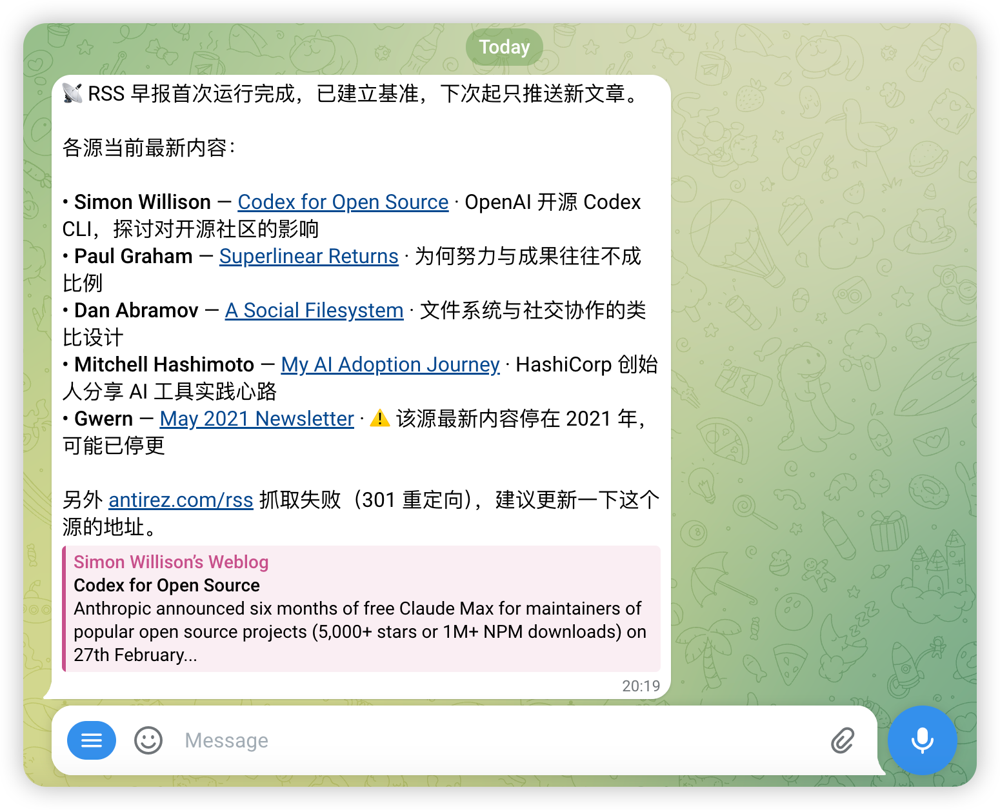

# Day 11：高级 Cron 任务 —— 打造全自动 RSS 订阅推送

> 🎯 **学习目标**：掌握 OpenClaw Cron 的高阶玩法（独立会话、消息推送等），并实战搭建一个自动监测大牛博客更新并推送到手机的 RSS 订阅机器人。

## 为什么需要高级 Cron？

在 [Day 5 基础 Cron 教程](day5-cron.md) 中，我们学习了如何设置简单的定时提醒。但那些任务通常只在你的**主会话 (Main Session)** 中运行，就像你在客厅里定了个闹钟，响了之后你马上放下手头的事去处理。

而在真实的自动化场景中，我们往往需要执行非常重度的后台任务（比如每天早上阅读几十个早报网页、抓取长篇文章进行深度翻译分析）。如果这些都放在主会话里：
1. **污染历史记录**：你的聊天界面会被大量的后台执行日志淹没。
2. **上下文过载**：后台任务不需要知道你昨天和 Agent 聊了什么，带着长长的历史记录运行既浪费资源又拖慢速度。

为此，我们要用到 OpenClaw Scheduler 的高阶特性：**Isolated Session（独立会话）** 与 **Delivery（消息推送）**。

---

## Cron的进阶概念

### 1. Isolated Session (独立会话)

类比：**在独立的会议室做事 vs 在客厅做事**。
当设置 `sessionTarget: "isolated"` 时，Agent 会在专门的沙盒环境（如 `cron:job-123`）中醒来。它拥有全新的记忆，不受主对话干扰，做完任务就销毁。

### 2. Delivery (消息推送)

既然任务是在"不可见"的独立会议室里做的，做出来的成果怎么交给你？这就需要配置 Delivery：
- `announce` 模式：将最终生成的报告，通过指定的渠道（如 `telegram`, `slack`, `feishu` 等）直接发到你的手机上。
- `webhook` 模式：将结果 POST 发送给你自己的服务器或其他系统。
- `none` 模式：默默做事，不发通知（适合定期清理数据等纯后台任务）。

### 3. Model & Thinking 覆盖

针对不同的任务，分配不同级别的"脑力"：
- **日常琐事**：默认模型即可。
- **每周深度长文分析**：可以通过 `--model opus --thinking high` 覆盖默认配置，指定它用最顶尖的模型开启深度思考模式。

---

## 实战项目：RSS 大牛博客监测机器人

我们将结合AI 大神 Andrej Karpathy 前段时间推荐的 [2025 年 Hacker News 热门博客列表](../resource/Andrej_recommend_RSS/hn-popular-blogs-2025.opml)，打造一个**全自动的信息捕手**：
它会定时去抓取这些极客博客（如 Redis 作者 antirez、YC 创始人 Paul Graham 等），一旦发现新文章，就让大模型自动总结成简洁的中文摘要，并把报告推送到你的手机（Telegram 或飞书）上！

### Step 1: 创建监测 Skill

首先，我们需要给 Agent 一份详细的"阅读抓取工作手册"。我们将借助 [Day 4 学习的 Skill 机制](day4-skills.md)。

创建目录并编写配置：
```bash
mkdir -p ~/.openclaw/workspace/skills/rss-monitor
cd ~/.openclaw/workspace/skills/rss-monitor
```

创建 `config.json`，这里我们从 Karpathy 推荐的列表中精选了 6 个神级博客（完整的 93 个源在工程内的 `resource/Andrej_recommend_RSS/hn-popular-blogs-2025.opml`，你可以根据兴趣自行替换）：
```json
{
  "feeds": [
    {
      "name": "Simon Willison",
      "url": "https://simonwillison.net/atom/everything/",
      "description": "AI 工具、LLM 应用前沿"
    },
    {
      "name": "Paul Graham",
      "url": "http://www.aaronsw.com/2002/feeds/pgessays.rss",
      "description": "创业与思维方式"
    },
    {
      "name": "antirez",
      "url": "http://antirez.com/rss",
      "description": "Redis 作者，系统编程思考"
    },
    {
      "name": "Overreacted",
      "url": "https://overreacted.io/rss.xml",
      "description": "React 核心作者 Dan Abramov"
    },
    {
      "name": "Mitchell Hashimoto",
      "url": "https://mitchellh.com/feed.xml",
      "description": "HashiCorp 创始人"
    },
    {
      "name": "Gwern",
      "url": "https://gwern.substack.com/feed",
      "description": "AI 研究与深度技术分析"
    }
  ],
  "max_articles_per_feed": 3
}
```

接着，编写 `SKILL.md` 指导 Agent 如何工作：
*(为节省篇幅，完整版 Skill 见 [`examples/skills/rss-monitor/SKILL.md`](../examples/skills/rss-monitor/SKILL.md))*

你需要在这个文件中明确告诉 Agent：
1. 用文件工具读取 `config.json` 里的源列表。
2. 遇到旧文档缺失（如 `last_check.json`）时不要慌，自己创建一个空字典。
3. 循环调用 `curl -sS --max-time 10 "<url>"` 抓取 RSS 的 XML 内容。
4. 将抓到的文章标题与 `last_check.json` 比对，从而判断什么是"新文章"。
5. 对新文章标题进行解读，生成结构化的中英文播报，并通过消息返回。

### Step 2: 用 CLI 命令配置计划任务

一切已就绪，现在我们用一行命令把这个强大的机器人挂载到按时触发的定时引擎上：

```bash
openclaw cron add \
  --name "RSS 早报" \
  --cron "0 8 * * *" \
  --tz "Asia/Shanghai" \
  --session isolated \
  --message "执行 rss-monitor 技能，检查配置的主力大牛博客是否有更新，并生成早报摘要返回。" \
  --announce \
  --channel telegram \
  --to "-1001234567890:topic:123"
```
*(注意：请将 `--channel` 和 `--to` 替换为你实际使用的渠道和群组 ID。如果使用飞书，对应填写 `--channel feishu`)*

**详细拆解这行命令：**
- `--cron "0 8 * * *"`: 标准的 cron 表达式（每天早上 8 点整）。结合 `--tz` 指定东八区时间。
- `--session isolated`: **关键！** 在纯净沙盒里运行，不干扰你的主线对线。
- `--announce ...`: 将跑完之后最后产出的那几条优美的 Markdown 排版摘要，强行推送到 Telegram 群的某个特定话题频道。

### Step 3: 手动执行并验证

不用真的等到明天早上 8 点，我们可以强制触发刚刚创建的任务。

1. 先列出所有任务，获取 `jobId`：
```bash
openclaw cron list
```

2. 强制运行它：
```bash
openclaw cron run <jobId>
```

3. 也可以查看它的运行日志历史（排障时非常有帮助）：
```bash
openclaw cron runs --id <jobId>
```

这时候你可以切到你的 Telegram 或飞书。大约十几秒后，你的大牛前沿动态早报就会生成了。运行结果如下所示：



---

## 进阶：配置全局重试策略 (Retry)

如果抓取目标网站偶尔抽风报 502/429（比如抓 Reddit 很容易中招），怎么办？
你可以在总配置文件 `~/.openclaw/openclaw.json` 中配置强大的重试容错（Backoff）：

```json5
{
  "cron": {
    "enabled": true,
    "retry": {
      "maxAttempts": 3,
      // 失败后分别等待 1分钟, 2分钟, 5分钟 再重试
      "backoffMs": [60000, 120000, 300000],
      "retryOn": ["rate_limit", "overloaded", "network", "server_error"]
    }
  }
}
```
配置后重启网关 `openclaw gateway restart` 即可生效。

---

## ✅ 今日练习

- [ ] 完成上面的 `rss-monitor` Skill 的配置。
- [ ] 仔细阅读 `resource/Andrej_recommend_RSS/hn-popular-blogs-2025.opml`，挑选 2 个你自己喜欢的国外博客（如 `daringfireball.net` 或 `pluralistic.net`），添加到 `config.json` 中。
- [ ] 使用 `openclaw cron add` 命令，将它设置为每两小时（`--every "7200000"` 或使用标准 cron `--cron "0 */2 * * *"`）运行一次的 Isolated 任务。
- [ ] 使用 `openclaw cron run` 体验一次推送效果～

---

[← 上一天：Webhook 驱动你的 Agent](day10-webhooks.md) | [下一天：工作流优化探索 →](day12-workflow.md)
